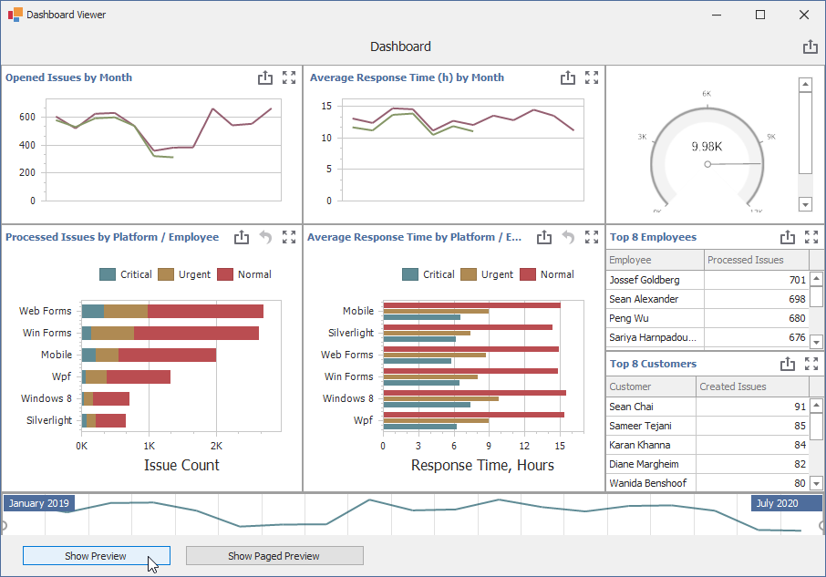

<!-- default file list -->
*Files to look at*:

* [DashboardExporter.cs](./CS/DashboardExport/DashboardExporter.cs) (VB: [DashboardExporter.vb](./VB/DashboardExport/DashboardExporter.vb))
* [Form1.cs](./CS/DashboardExport/Form1.cs) (VB: [Form1.vb](./VB/DashboardExport/Form1.vb))
<!-- default file list end -->
# How to Use the PrintableComponentLink to Print a Dashboard

This example demonstrates the use of the [PrintableComponentLink](https://docs.devexpress.com/WindowsForms/DevExpress.XtraPrinting.PrintableComponentLink) to print a dashboard.

A custom **DashboardExporter** class implements the [IPrintable](https://docs.devexpress.com/WindowsForms/DevExpress.XtraPrinting.IPrintable) interface and encapsulates all logic required to specify page settings, create a PrintableComponentLink and show the **Print Preview** window. Use the **Show Preview** and **Show Paged Preview** buttons to view the result.

